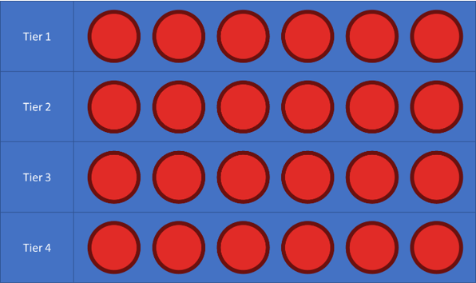
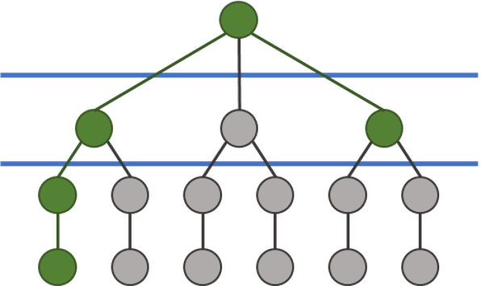

# Overview

- This is an idea for an online multiplayer game
- The goal would be to bring elements of a fate/diablo/runescape type world in with that of a MOBA
    - This concept is very much in its early stages, and is quite rusty
- It is not necessarily bringing the 2 different types of "worlds" into 1, but more so having 2 different "worlds" in the same "universe" (just generic terms to try and have it make sense)
    - You have the more free roaming PvM world, where you can train, and get a sense of progression/leveling/unlocking
    - And then you can take your character into a more action-packed PvP arena
    - This presents a few potential issues/questions
        - Having this combination make sense in the context of the game
        - Making it balanced/fair
        - Are you forced to do things in both places, or can you stick to / lean towards one if you like it more?
- You have 3 different character classes: melee, ranged, magic
- Each character class has its own unique set of abilities, with 4 ability slots
    - Once an ability is unlocked, you can select how you want to combine these abilities
    - Abilities would be the primary aspect of the game, as well as the sense of progression
    - There are 4 tiers of abilities  
    
    - An ability can then be further upgraded.  
    
        - You can choose `(WIP)` 2/3 `or` 3/5 `(?)` upgrades for an ability
        - Then `(WIP)` one of those `or` each of those `(?)` upgrades can take 1/2 additional upgrade paths
        - Then that path can be upgraded 1 time more
    - The idea would be that a Tier `x` ability with its first upgrade tier filled out should be roughly as strong as a Tier `x+1` ability,  
    and a Tier `x` ability that is fully upgraded should be roughly as strong as a Tier `x+2` ability
    - Abilities and upgrades have a certain point cost to them
    - Based on your level, you can only have a certain cost of abilities in any given loadout
        - As mentioned in above, the goal would be to have a consistent relation between the ability tiers, and this should be reflected in the cost
        - Max level should leave you with a number of points that makes a combination of primarily tier 2/3/4 abilities viable  
        aka: max level shouldnt leave you able to have all maxed-out tier 4 abilities
- The idea here is to open up unique combinations, allowing for creative strategies and play-styles, especially once you bring multiple players into in the mix
- Each character class would have abilities of different types  
ex: offense, defense, mobility, utility
- Example thoughts for upgrades
    - Something simple, like tweaking values of the ability (damage, healing, duration, cooldown, `~`mana, ...)
    - Adding extra effects to the ability
    - Adding passives, or an active if it was a passive in the first place
    - Adding a second cast to the ability (think lee sin's abilities)
    - Creating a double edged sword, the ability becomes better in one way, and worse in others  
    Then, with the next tier, you could double down on the good, or reduce/remove the bad
- Going back to the integration of the 2 different "worlds"
    - Abilities would almost certainly need tweaking in PvM vs PvP
        - Hopefully this would be limited to scaling values
        - Although, it might be possible to just alter how strong monsters are to have it end up working out the same
        - This might end up just making it to complicated, and maybe having separate values is better, while trying to keep them as similar as possible
        - For example, something like a 3 second stun might be insane in a PvP, but makes sense against a monster
    - PvM
        - Should it be more free-roam, or quest based?
            - If it is more quest based, should it be a more of a single big story-line, or many smaller ones, or both?
            - The best thing I can think of at the moment is a runescape type world, with different monsters everywhere, and many smaller quests, that fit into an overall bigger story, but that story isnt necessarily front and center all the time
        - Killing monster `x` drops `x`-fragments, which once you collect a certain number of fragments, can be rolled in a drop table
        - Possibly have different difficulties, and harder difficulties yeield better drops?
        - What should be the difference between playing solo, or going with a team?
        - I have a feeling I wouldnt want it to be like runescape, where there are many people on the same world, I think I would want it to just be you and your team, if you have one
        - When you roll items, you can then wear the expected sort of armor/weapon slots (limited to your character class `(?)`)
        - Should trading be allowed?
            - My gut feeling is no, I feel like you could just boost others through the game that way
            - Unless a different system other than what is mentioned next comes up
        - Items you dont want, you can cash in, and then use whatever currency that yields in order to unlock abilities
    - PvP
        - Different game-modes `(?)` (very experimental thoughts)
            - 3v3
                - Locked character classes (1,1,1)
                - Unbounded
            - 6v6
                - Locked character classes (2,2,2)
                - Bounded character classes (1+,1+,1+)
                - Unbounded
            - Possibilities for even larger game-modes?
                - Would probably be more for just fun, instead of ranked, as it would be really chaotic
        - Should playing matches in this "world" also yield the previously mentioned currency?
    - Do items earned in PvM cross into PvP?
        - I could see this making a lot of sense from the perspective of why good items would matter
        - But this could really throw off fair matchmaking
        - Maybe it only shows up in the more "fun" game-modes?
- Possible monetization `(?)` (very much brainstorming)
    - Purchasing currency
        - Gives you free progression, without necessarily making you stronger
    - Skins
        - Character skins
        - Ability skins `(?)` (gives abilities different look/animations)
        - Would be pretty easy to make many skins for characters, as there are only 3
